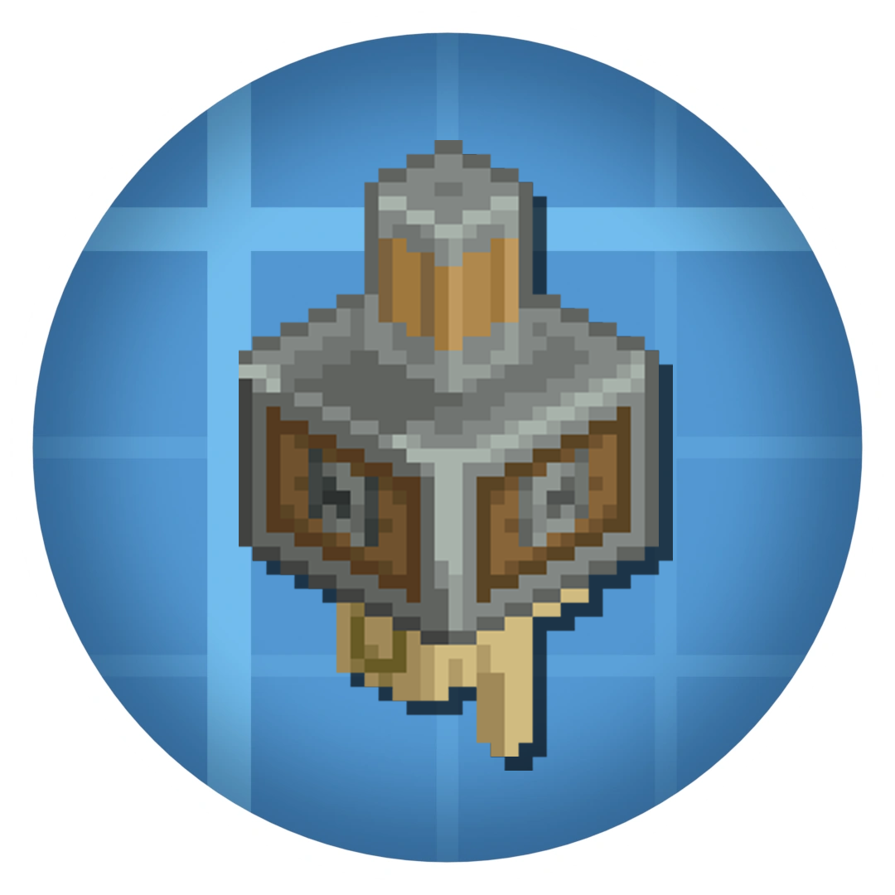

# 

Deployer is a Create library addon that extends logistics, gauges, and fluid systems while prioritizing stability over compatibility.

## Philosophy

Our philosophy is "less compatibility, more stability." Every feature is coded to handle modifications from other mods gracefully. When conflicts occur, we prefer our features to fail safely rather than crash the game.

We still care about compatibility. If you encounter issues with specific mods, please let us know and we will work to support them.

**Note: Deployer is in beta. Crashes may still occur with some mod combinations.**

## Features

### Stock Inventory System

The stock inventory system extends Create 6.0's logistics framework by introducing a standardized API for packageable inventory types. This system enables developers to define custom inventory types that can be packaged, transported, and ordered through Create's stock ticker mechanism.

At its core, a stock inventory type represents any content that can be encapsulated within a package entity and requested through logistics networks. The API is designed for simplicity and modularity, allowing developers to implement complex packaging systems with minimal code. For example, a complete fluid packaging system can be implemented using only four Java classes, as demonstrated in the included reference implementation.

This extensibility allows mod developers to integrate their own inventory types into Create's logistics system without modifying Create's core code. Items, fluids, energy, or even custom data structures can be packaged and distributed through the existing logistics infrastructure, making the system highly versatile for modpack creators and addon developers.

*A basic fluid packaging system implementation*

### Gauge Creation API

Deployer provides a comprehensive API for creating custom gauges, evolved from the Extra Gauges addon. Rather than bundling gauge functionality with specific gauge implementations, Deployer separates the API layer from content, giving developers full control over what gauges they include in their projects.

This architectural decision means mod developers can leverage the gauge creation system without importing unnecessary built-in gauge types. You can define gauges that display any measurable value such as stress units, fluid levels, energy storage, or custom metrics specific to your mod's mechanics. The API handles rendering, tooltips, and integration with Create's existing UI framework, allowing you to focus on the gauge's data logic rather than display implementation.

By centralizing the gauge API in a library mod, multiple addons can create gauges that share a consistent visual language and behavior, improving the overall user experience across the Create ecosystem.

### Extended Goggle Information

Create's vanilla goggle overlay system only supports block entities, limiting what information can be displayed when players look at blocks or entities. Deployer extends this functionality through the `DeployerGoggleInformation` interface, enabling goggle information display for regular blocks without block entities and for entities in the world.

This extension allows you to provide contextual information for any game object. For example, you can display data for lightweight blocks that do not require the overhead of a block entity, or show statistics and status information for moving entities like minecarts, contraptions, or custom entity types.

The interface integrates seamlessly with Create's existing goggle system, maintaining the same visual style and interaction patterns players are familiar with. Information is displayed in the same overlay format, supports rich formatting, and can include dynamic data that updates in real-time as the player observes the target.

*Goggle information displayed for an entity*

### Fluid Capability Fix

Create's fluid handling systems are designed around block entities, which creates limitations when interacting with blocks that provide fluid storage or access without using block entities. Vanilla blocks like cauldrons and modded blocks with alternative fluid storage implementations cannot be accessed by Create's pumps, pipes, and other fluid-handling components.

Deployer addresses this limitation by implementing a compatibility layer that extends Create's fluid interaction logic to work with any block that provides fluid capabilities, regardless of whether it uses a block entity. This fix is configurable through the server configuration file, allowing server administrators to enable or disable the behavior based on their performance requirements and desired gameplay mechanics.

With this fix enabled, Create's fluid network can interact with previously incompatible blocks. Cauldrons can be filled or drained by mechanical pumps, modded fluid blocks work with fluid pipes, and any block exposing fluid capabilities through standard Forge or Fabric APIs becomes part of the fluid logistics network.

*Cauldrons and other non-block-entity fluid containers now work with Create's fluid systems*
